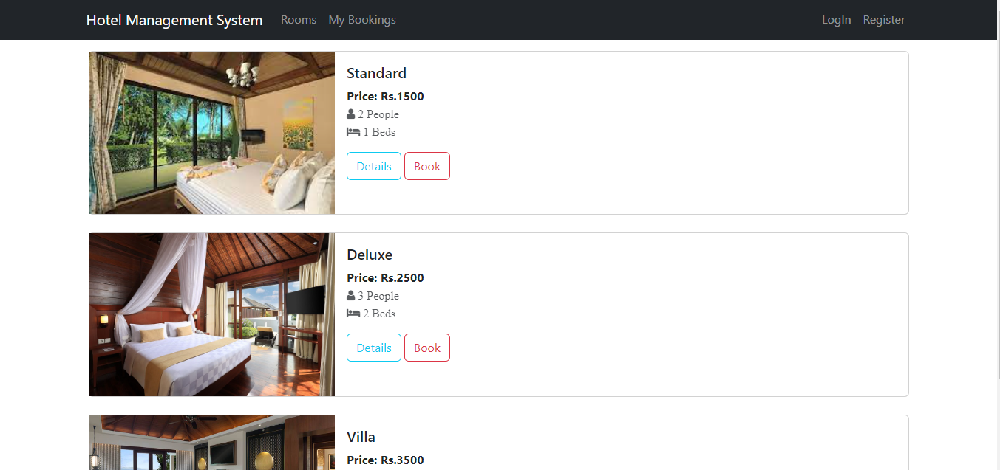
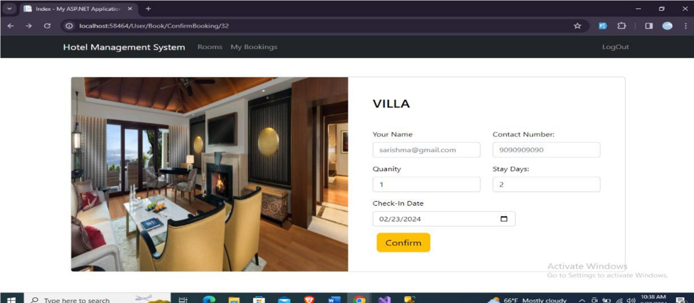
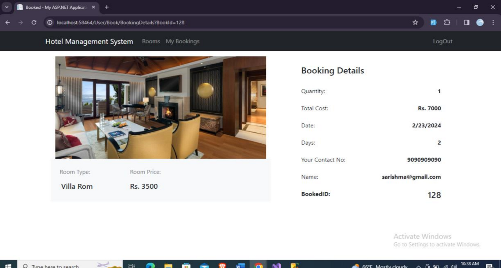
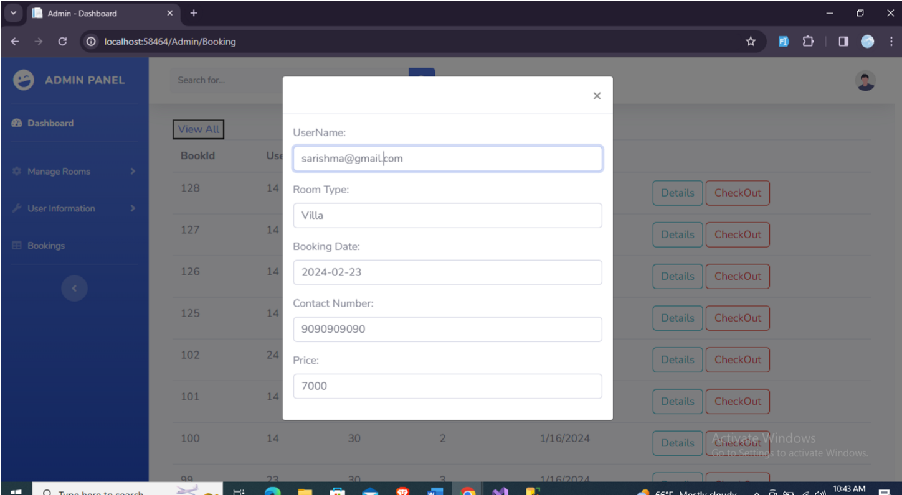

# Hotel Management System

This is a basic Hotel Management System built using **ASP.NET MVC (.NET Framework)** with Entity Framework (Database-First). The system is divided into two areas: **Admin** and **User**.

---
## 🖼️ Project Screenshots  

### 🏠 Home Page
<p align="center">
  
</p>

---

### 🛎️ Booking & Dashboard Overview
<p align="center">
  
</p>
<p align="center">
  
</p>

---

### 👨‍💻 Admin Panel
Admin panel for managing hotel operations, rooms, and bookings.
<p align="center">
  
</p>

---
## 🔧 Features

### 👤 User Area
- View room details and availability
- Book rooms online
- Make payments through online payment integration

### 🔐 Admin Area
- View and manage room bookings
- Add, update, or delete room information and availability

---

## 🛠️ Tech Stack

- ASP.NET MVC (.NET Framework)
- Entity Framework (Database-First with `.edmx`)
- SQL Server (SSMS)
- Razor Views (.cshtml)
- JavaScript / jQuery

---

## 🚀 Project Setup

Follow these steps to set up and run the project locally:

### 1. Clone the Repository

```bash
git clone https://github.com/your-username/hotel-management.git
cd hotel-management

### 2. Generate the Database from .edmx file

- Open the .edmx file in Visual Studio (Entity Designer View)

- Right-click on the designer surface and select:
(Generate Database from Model...)
- A SQL script will be generated from the model
- Copy that SQL script

### 3. Create the  Database in SSMS and later configure the connection string

web.config:

<connectionStrings>
  <add name="HotelEntities" 
       connectionString="metadata=res://*/Models.HotelModel.csdl|res://*/Models.HotelModel.ssdl|res://*/Models.HotelModel.msl;
                         provider=System.Data.SqlClient;
                         provider connection string='data source=YOUR_SERVER_NAME;initial catalog=HotelDB;integrated security=True;
                         MultipleActiveResultSets=True;App=EntityFramework'" 
       providerName="System.Data.EntityClient" />
</connectionStrings>

